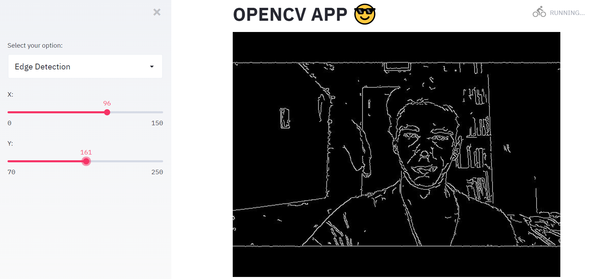

## OpenCV APP

### Introduction

This project combines Streamlit with OpenCV. It detects the camera input an allows to apply some filters.

### Requirements

To run the code:

Make sure to have installed streamlit and opencv or installed as shown below from your terminal.

* *pip install streamlit==0.64.0* 

* *pip install opencv-python==4.1.1.26*

To make sure streamlit works properly you can try:

* *streamlit hello*
  
To execute the app type:

* *streamlit run https://github.com/Engeniuseer/OpenCV_App/blob/master/app.py*

### References

I used the file haarcascade_frontalface_default.xml for the face detection from https://github.com/opencv/opencv/blob/master/data/haarcascades/haarcascade_frontalface_default.xml
